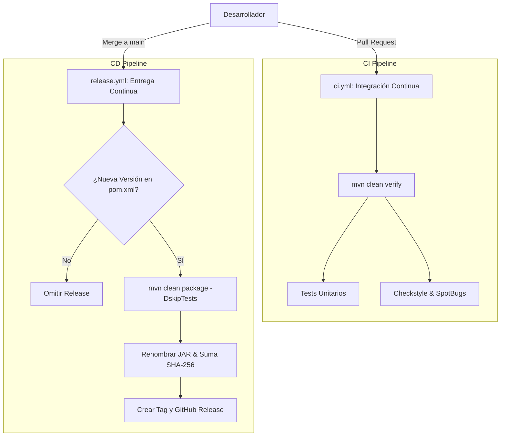

# Especificación de Diseño: Pipeline de CI/CD de Calidad y Entregas Automáticas

**Fecha**: 2026-06-23  
**Proyecto**: [file2file](file:///C:/Users/JoseSanchez3/OneDrive%20-%20EPAM/Documents/workspace_joselu/file2file)  
**Estado**: Aprobado por el usuario  

---

## 1. Introducción y Objetivos
El objetivo de este diseño es establecer un pipeline de Integración Continua (CI) y Entrega Continua (CD) profesional para el proyecto `file2file`. El sistema automatizará el análisis estático de código, la ejecución de pruebas y el ciclo de versionado y publicación de releases.

Específicamente, el pipeline debe:
1. Validar la calidad del código mediante **Checkstyle** y **SpotBugs** integrados en Maven.
2. Garantizar la ejecución exitosa de todas las pruebas unitarias.
3. Detectar de manera autónoma incrementos de versión en `pom.xml` al fusionar cambios a `main`.
4. Generar tags de Git y releases de GitHub automáticas que incluyan el JAR sombreado (`shaded fat JAR`) renombrado y su checksum `SHA-256`.

---

## 2. Arquitectura de Workflows (GitHub Actions)

Adoptamos un diseño de workflows separados para segmentar responsabilidades y optimizar la seguridad de los tokens de GitHub.

### 2.1 Workflow de CI (`ci.yml`)
* **Ubicación**: `.github/workflows/ci.yml`
* **Eventos**: `pull_request` a `main` y `push` en cualquier rama secundaria.
* **Permisos**: Mínimos (`contents: read`).
* **Comando principal**: `mvn clean verify` (compilación, pruebas unitarias y validaciones estáticas de calidad).

### 2.2 Workflow de CD (`release.yml`)
* **Ubicación**: `.github/workflows/release.yml`
* **Eventos**: `push` en la rama `main`.
* **Permisos**: Escritura de contenido (`contents: write`) para crear tags y releases.
* **Pasos**:
  1. Descargar el repositorio y configurar Java 17.
  2. Extraer la versión actual del `pom.xml`.
  3. Comprobar si existe un tag remoto llamado `v{version}`. Si ya existe, detener el pipeline pacíficamente.
  4. Si no existe el tag, ejecutar `mvn clean package -DskipTests`.
  5. Renombrar el JAR resultante a `file2file-v{version}.jar` y generar su hash `SHA-256`.
  6. Crear la GitHub Release subiendo el JAR y su hash, generando automáticamente el tag.

---

## 3. Configuración de Calidad en Maven

Para que las reglas de calidad sean ejecutables tanto localmente como en el pipeline de CI, se configuran Checkstyle y SpotBugs en el archivo `pom.xml`.

### 3.1 Checkstyle
* **Reglas (`checkstyle.xml`)**:
  * Prohibición de imports wildcard (`*`).
  * Validación de nomenclatura estándar de Java (CamelCase, PascalCase, UPPER_SNAKE_CASE).
  * Uso de llaves obligatorio en todas las estructuras de control (`if`, `for`, `while`).
  * Longitud de línea máxima de 120 caracteres.
  * **Prohibición del uso directo de `System.out.print` y `System.err.print`** para forzar el uso de `java.util.logging.Logger`.
* **Plugin Maven**: `maven-checkstyle-plugin` en fase de `validate`.

### 3.2 SpotBugs
* **Propósito**: Detección de posibles bugs lógicos, desbordamientos de buffers y malas prácticas de programación.
* **Plugin Maven**: `spotbugs-maven-plugin` configurado en la fase de `verify` con esfuerzo máximo (`Max`) y severidad media (`Medium`).

---

## 4. Estructura de Archivos a Crear / Modificar

1. **`pom.xml`**: Modificar para incluir dependencias de plugins de Checkstyle y SpotBugs vinculadas a las fases de compilación y verificación.
2. **`checkstyle.xml`**: Crear en la raíz del proyecto para definir el conjunto de reglas de calidad.
3. **`.github/workflows/ci.yml`**: Crear para el pipeline de validación.
4. **`.github/workflows/release.yml`**: Crear para el pipeline de tagging, release y publicación de binarios.
